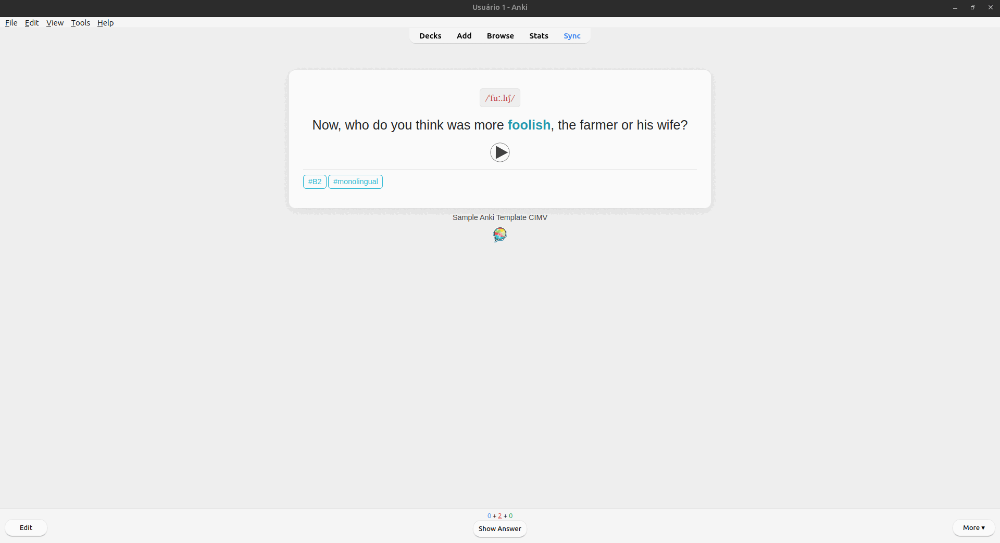

# CIMV Anki Template

A **clean, minimalist, and highly readable Anki template** designed for Mairo Vergara's English course. Ideal for learning vocabulary, grammar, pronunciation, and reviewing efficiently.

  
_Quick preview of cards in action_

## 🛠 Installation & Usage

  
_Example card with audio, phonetic transcription, and stylized tags_

## 🙏 Credits

Inspired by Mairo Vergara's English course.

---

## 📄 License

This project is **open source** under the **MIT License**, free for personal or educational use.
